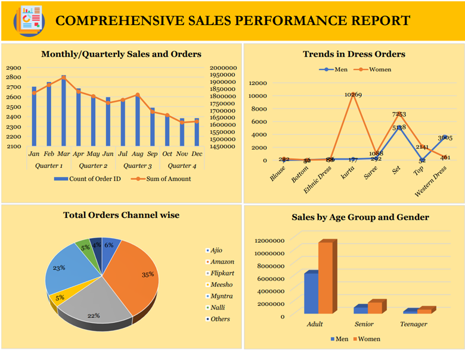
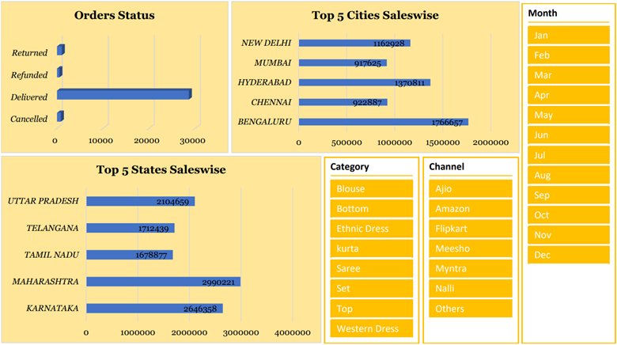
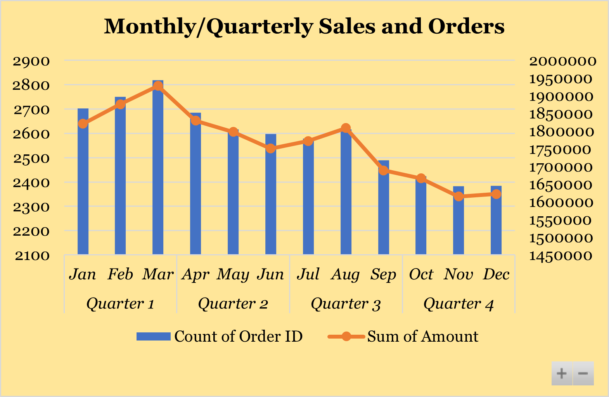
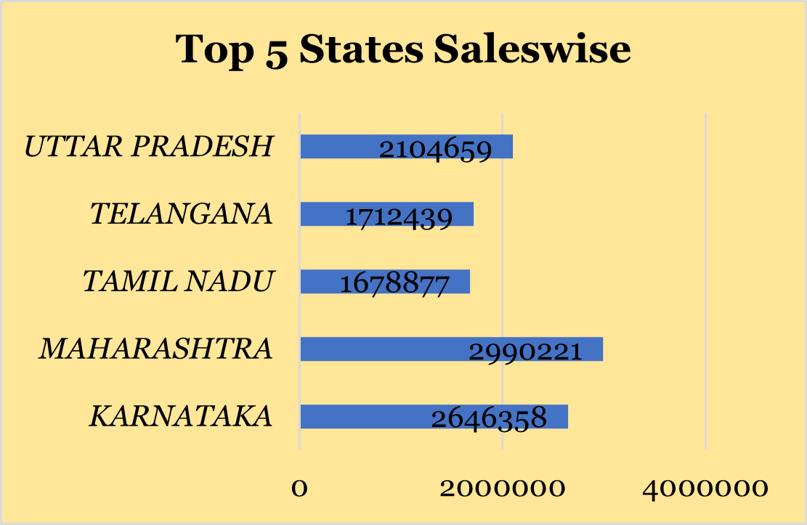
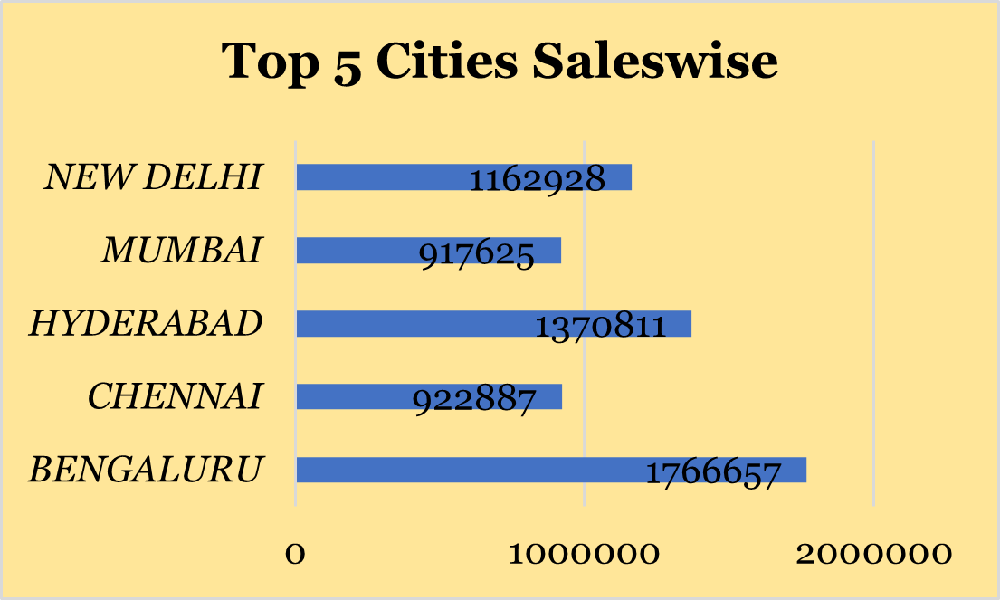
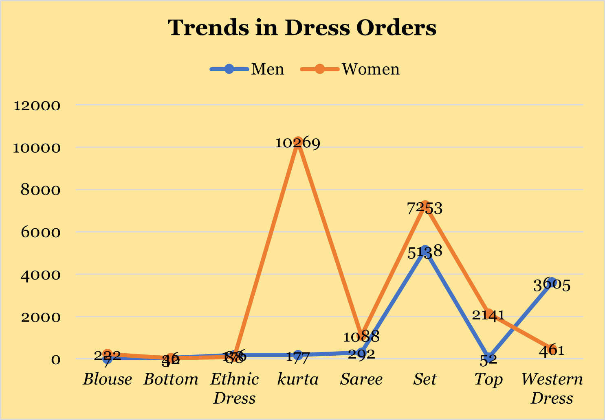
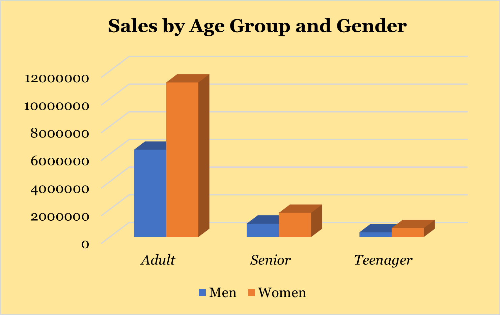
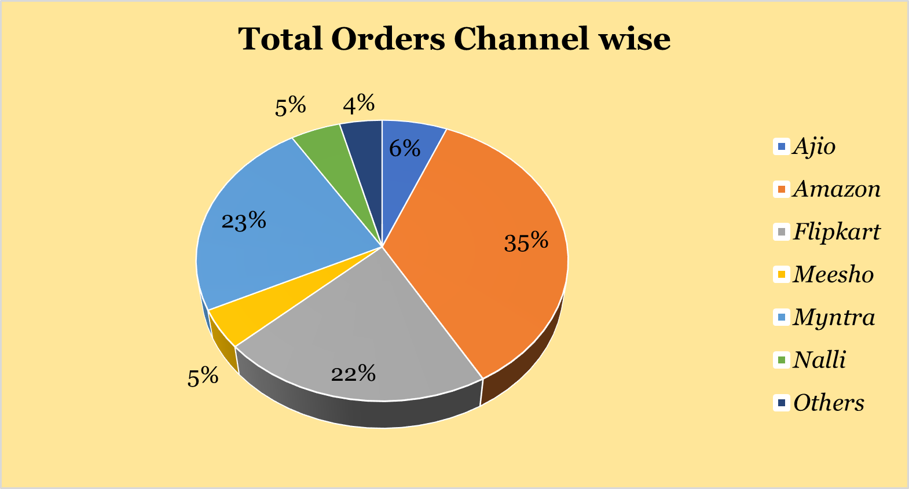
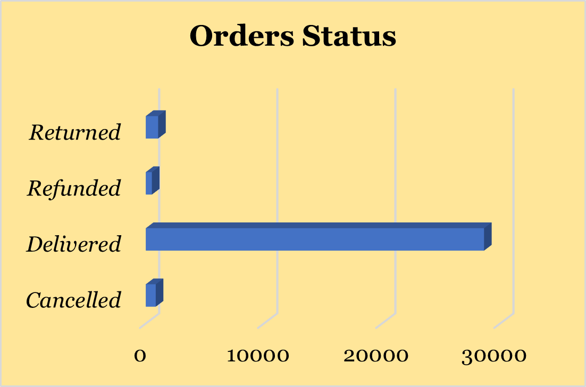

# Introduction
This analysis provides a comprehensive overview of sales performance across various dimensions using e-commerce data. The dataset includes monthly and quarterly sales trends, regional performance by top states, platform-wise order distribution, and customer demographics.

# Tools I Used
- Microsoft Excel (mainly used PivotTables and PivotCharts)

# The Analysis and Visualization
## Overview
I used PivotTables to summarize the data I need and then visualized them more by using PivotCharts. I also included slicers for filtering the data.

### 1. Quarterly Sales and Orders

#### Insights:
- Quarter 1 has the highest orders (8271) and sales (₹5.62M).

#### Monthly breakdown in Q1:
- March leads with 2819 orders and ₹1.93M in sales.

- Sales and orders gradually decline each quarter, with Quarter 4 being the lowest (7191 orders, ₹4.9M).

### 2. Highest-Grossing States

#### Insights:
- Maharashtra leads in sales with 2.99 million, contributing the highest to the overall total.

- The combined sales of Karnataka and Uttar Pradesh (approx. 4.75 million) account for over 40% of the 11.13 million grand total.

- Tamil Nadu and Telangana have similar contributions, each around 1.7 million, showing a more moderate performance.

### 3. Highest-Grossing Cities

#### Insights:
- Bengaluru tops the chart with 1.77 million in sales, contributing the most among all cities.

- Hyderabad and New Delhi follow with 1.37 million and 1.16 million, showing strong urban performance.

- Chennai and Mumbai have similar sales figures (~920K), indicating moderate contributions to the 6.14 million total.

### 4. Trends in Dress Purchases

#### Insights:
- Women dominate overall orders with ~69% (21,554 out of 31,047 total orders), especially for items like Kurta, Set, and Top.

- The most popular item overall is the Set category (12,391 orders), followed by Kurta (10,446 orders).

- Men's top preferences are Set (5,138 orders) and Western Dress (3,605 orders), indicating distinct buying patterns compared to women.

### 5. Demographic Breakdown of Sales

#### Insights:
- Adults dominate sales, contributing over 82% of the total revenue (~₹17.5M), making them the most valuable customer group.

- Women account for ~64% of total sales (₹13.56M vs. ₹7.61M for men), consistently outspending men across all age groups.

- Teenagers contribute the least (~₹986K), suggesting minimal purchasing power or lower marketing focus.

### 6. Sales Channel Performance

#### Insights:
- Amazon leads with 35.5% of total orders, followed by Myntra (23.4%) and Flipkart (21.6%).

- The top 3 platforms contribute over 80% of the 31,047 total orders.

- Ajio, Meesho, Nalli, and Others together make up the remaining ~19.5%.

### 7. Order Status

